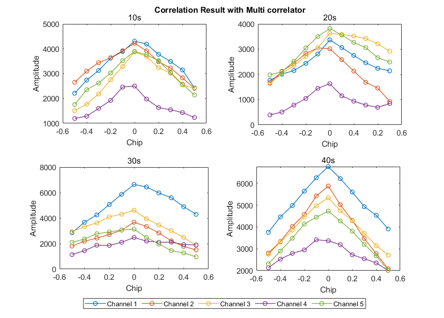

# AAE6102 Assignment 1

## Satellite Communication and Navigation (2024/25 Semester 2)

### The Hong Kong Polytechnic University  
**Department of Aeronautical and Aviation Engineering**  

**Due Date:** 13 March 2025  

## Overview  
This assignment focuses on processing **GNSS Software-Defined Receiver (SDR) signals** to develop a deeper understanding of **GNSS signal processing**. Students will analyze **two real Intermediate Frequency (IF) datasets** collected in different environments: **open-sky** and **urban**. The urban dataset contains **multipath and non-line-of-sight (NLOS) effects**, which can degrade positioning accuracy.

### Dataset Information  

| Environment | Carrier Frequency | IF Frequency | Sampling Frequency | Data Format | Ground Truth Coordinates | Data Length | Collection Date (UTC) |
|------------|------------------|--------------|-------------------|------------|-----------------------|------------|-----------------|
| Open-Sky  | 1575.42 MHz | 4.58 MHz | 58 MHz | 8-bit I/Q samples | (22.328444770087565, 114.1713630049711) | 90 seconds | 14/10/2021 12.21pm|
| Urban     | 1575.42 MHz | 0 MHz | 26 MHz | 8-bit I/Q samples | (22.3198722, 114.209101777778) | 90 seconds | 07/06/2019 04.49am |

    

Figure 0. Data Collection Locations

## Assignment Tasks  

### **Task 1 – Acquisition**  
Process the **IF data** using a **GNSS SDR** and generate the initial acquisition results.

**Solution:**

    

Figure 1.1 Not Acquired Signal

    

Figure 1.2 Acquired Signal

    

Figure 1.3 Open-Sky Acquisition Results

    

Figure 1.4 Urban Acquisition Results

---

### **Task 2 – Tracking**  
Adapt the **tracking loop (DLL)** to generate **correlation plots** and analyze the tracking performance. Discuss the impact of urban interference on the correlation peaks. *(Multiple correlators must be implemented for plotting the correlation function.)*

**Solution:**

    

Figure 2.1 Tracking Results for Open-Sky PRN 16

    

Figure 2.2 Open-Sky Correlation Results with Multi-correlator in 4 Epochs

    

Figure 2.3 Urban Correlation Results with Multi-correlator in 4 Epochs

    

Figure 2.4 Tracking Results for Urban PRN 1

**Impact of Urban Interference**  
- Multipath Effects: Reflected signals cause constructive and destructive interference, leading to distorted correlation peaks.  
- NLOS Receptions: Signals arriving via indirect paths introduce biases in the pseudorange measurements.  
- Signal Attenuation: Buildings and other structures can attenuate the signal, reducing the signal-to-noise ratio (SNR) for satellites of Channel 3 and Channel 4.    

**Discussion**  
- In the open-sky environment, the DLL performs well with clear correlation peaks, allowing for accurate tracking.  
- In the urban environment, the DLL performance degrades due to interference, resulting in less accurate and less stable tracking.  
Multiple correlators help in maintaining lock by providing a more robust estimate of the signal phase.

---

### **Task 3 – Navigation Data Decoding**  
Decode the **navigation message** and extract key parameters, such as **ephemeris data**, for at least one satellite.

**Solution:**

| Parameters         | Description                                                                 | Value          |
|--------------------|-----------------------------------------------------------------------------|----------------|
| PRN               | Pseudo-Random Noise code number identifying individual satellites           | 16, 22, 26, 27, 31 |
| C_ic              | Cosine correction term for orbit inclination, correcting periodic orbit inclination changes | -1.01E-07, -1.01E-07, -2.05E-08, 1.08E-07, -1.14E-07 |
| omega_0           | Longitude of ascending node, longitude where satellite orbit crosses Earth | -1.67426, 1.272735, -1.81293, -0.71747, -2.78727 |
| C_is              | Sine correction term for orbit inclination, correcting periodic orbit inclination changes | 1.36E-07, -9.31E-08, 8.94E-08, 1.15E-07, -5.03E-08 |
| i_0               | Orbit inclination, angle between satellite                                  | 0.971603, 0.936455, 0.939912, 0.974728, 0.955883 |
| C_rc              | Cosine correction term for semi-major axis, correcting periodic semi-major axis changes | 237.6875, 266.3438, 234.1875, 230.3438, 240.1563 |
| omega             | Argument of perigee, angle between ascending node and perigee in satellite orbit | 0.679609, -0.88789, 0.295685, 0.630882, 0.311626 |
| omegaDot          | Rate of change of right ascension of ascending node                          | -8.01E-09, -8.67E-09, -8.31E-09, -8.02E-09, -7.99E-09 |
| IODE_sf3          | Ephemeris data version identifier                                           | 9, 22, 113, 30, 83 |
| iDot              | Rate of change of orbit inclination                                         | -4.89E-10, -3.04E-11, -4.18E-10, -7.14E-13, 3.21E-11 |
| idValid           | Validity of satellite signal identifiers                                    | [2,0,3], [2,0,3], [2,0,3], [2,0,3], [2,0,3] |
| weekNumber        | Week number of satellite launch, determining data timeliness                | 1155, 1155, 1155, 1155, 1155 |
| accuracy          | Accuracy of satellite data                                                 | 0, 0, 0, 0, 0 |
| health            | Satellite health status                                                    | 0, 0, 0, 0, 0 |
| T_GD              | GPS signal group delay difference                                           | -1.02E-08, -1.77E-08, 6.98E-09, 1.86E-09, -1.30E-08 |
| IODC              | Ephemeris data identifier for detecting changes                             | 234, 218, 15, 4, 228 |
| t_oc              | Ephemeris reference time                                                   | 396000, 396000, 396000, 396000, 396000 |
| a_f2              | Second-order term coefficient for satellite clock correction                | 0, 0, 0, 0, 0 |
| a_f1              | First-order term coefficient for satellite clock correction                 | -6.37E-12, 9.21E-12, 3.98E-12, -5.00E-12, -1.93E-12 |
| a_f0              | Zero-order term coefficient for satellite clock correction                  | -0.00041, -0.00049, 0.000145, -0.00021, -0.00014 |
| IODE_sf2          | Ephemeris data version identifier (Part 2)                                  | 9, 22, 113, 30, 83 |
| C_rs              | Sine correction term for semi-major axis                                   | 23.34375, -99.8125, 21.25, 70.4375, 30.71875 |
| deltan            | Mean motion difference                                                     | 4.25E-09, 5.28E-09, 5.05E-09, 4.03E-09, 4.81E-09 |
| M_0               | Mean anomaly at reference time                                             | 0.718117, -1.26097, 1.735571, -0.17302, 2.824523 |
| C_uc              | Cosine correction term for orbital eccentricity                             | 1.39E-06, -5.16E-06, 1.15E-06, 3.73E-06, 1.46E-06 |
| e                 | Orbital eccentricity                                                        | 0.012296, 0.006714, 0.006254, 0.009574, 0.010272 |
| C_us              | Sine correction term for orbital eccentricity                               | 7.69E-06, 5.17E-06, 7.04E-06, 8.24E-06, 7.23E-06 |
| sqrtA             | Square root of semi-major axis                                             | 5153.771, 5153.712, 5153.636, 5153.652, 5153.622 |
| t_oe              | Ephemeris reference time                                                   | 396000, 396000, 396000, 396000, 396000 |
| TOW               | Time of Week                                                               | 390102, 390102, 390102, 390102, 390102 |

---

### **Task 4 – Position and Velocity Estimation**  
Using the pseudorange measurements obtained from tracking, implement the **Weighted Least Squares (WLS)** algorithm to compute the user's position and velocity.  
- Plot the user **position** and **velocity**.  
- Compare the results with the **ground truth**.  (Please see Task 5)
- Discuss the impact of **multipath effects** on the WLS solution.

**Solution:**

**Weighted Least Squares (WLS) Algorithm:**

The WLS algorithm is used to estimate the user's position and velocity based on pseudorange measurements. The algorithm minimizes the weighted sum of squared residuals between the measured pseudoranges and the pseudoranges calculated based on the estimated position.

The cost function for WLS is given by:

$$
J(\mathbf{x}) = (\mathbf{y} - \mathbf{H}\mathbf{x})^T \mathbf{W} (\mathbf{y} - \mathbf{H}\mathbf{x})
$$

Where:
- $\mathbf{x}$ is the state vector (position and velocity).
- $\mathbf{y}$ is the vector of pseudorange measurements.
- $\mathbf{H}$ is the design matrix that maps the state vector to the measurements.
- $\mathbf{W}$ is the weight matrix, which is a diagonal matrix, with its diagonal elements being sin(el).

The solution is obtained by solving:

$$
\hat{\mathbf{x}} = (\mathbf{H}^T \mathbf{W} \mathbf{H})^{-1} \mathbf{H}^T \mathbf{W} \mathbf{y}
$$

- The user **position** in opensky and urban scenario are displayed below.    

    

Figure 4.1 WLS Position Results for Open-Sky

    

Figure 4.2 WLS Position Results for Urban

- Discuss the impact of **multipath effects** on the WLS solution.  
Multipath effects cause signal reflections and interference, leading to biased pseudorange and doppler frequency measurements. In urban areas, this results in wider and less defined correlation peaks, making it harder for the DLL to maintain lock. Consequently, the WLS solution experiences larger position and velocity errors due to these distorted measurements, significantly degrading overall positioning accuracy.

---

### **Task 5 – Kalman Filter-Based Positioning**  
Develop an **Extended Kalman Filter (EKF)** using **pseudorange and Doppler measurements** to estimate **user position and velocity**.

**Solution:**
**Extended Kalman Filter (EKF):**

The EKF is a recursive algorithm used to estimate the state of a nonlinear system. The algorithm linearizes the system model around the current state estimate using a Taylor series expansion and then applies the Kalman filter equations.

The EKF algorithm consists of two main steps: prediction and update.

**Prediction Step:**

$$  
\mathbf{x}_{k|k-1} = f(\mathbf{x}_{k-1|k-1}, \mathbf{u}_k)  
$$  

$$
\mathbf{P}_{k|k-1} = \mathbf{F}_k \mathbf{P}_{k-1|k-1} \mathbf{F}_k^T + \mathbf{Q}_k
$$

Where:
- $\mathbf{x}_{k|k-1}$ is the predicted state estimate.
- $\mathbf{P}_{k|k-1}$ is the predicted error covariance.
- $f$ is the state transition function.
- $\mathbf{F}_k$ is the Jacobian matrix of $f$ evaluated at $\mathbf{x}_{k-1|k-1}$.
- $\mathbf{Q}_k$ is the process noise covariance matrix.

**Update Step:**

$$
\mathbf{y}_k = \mathbf{z}_k - h(\mathbf{x}_{k|k-1})
$$

$$
\mathbf{S}_k = \mathbf{H}_k \mathbf{P}_{k|k-1} \mathbf{H}_k^T + \mathbf{R}_k
$$

$$
\mathbf{K}_k = \mathbf{P}_{k|k-1} \mathbf{H}_k^T \mathbf{S}_k^{-1}
$$

$$
\mathbf{x}_{k|k} = \mathbf{x}_{k|k-1} + \mathbf{K}_k \mathbf{y}_k
$$

$$
\mathbf{P}_{k|k} = (\mathbf{I} - \mathbf{K}_k \mathbf{H}_k) \mathbf{P}_{k|k-1}
$$

Where:
- $\mathbf{y}_k$ is the measurement residual.
- $\mathbf{S}_k$ is the measurement covariance.
- $h$ is the measurement function.
- $\mathbf{H}_k$ is the Jacobian matrix of $h$ evaluated at $\mathbf{x}_{k|k-1}$.
- $\mathbf{R}_k$ is the measurement noise covariance matrix.
- $\mathbf{K}_k$ is the Kalman gain.
- $\mathbf{x}_{k|k}$ is the updated state estimate.
- $\mathbf{P}_{k|k}$ is the updated error covariance.

- The results obtained from WLS and EKF method are displayed below.

    

Figure 5.1 Open-Sky Position Solution with WLS and EKF

    

Figure 5.2 Open-Sky Velocity Solution with WLS and EKF

    

Figure 5.3 Urban Position Solution with WLS and EKF

    

Figure 5.4 Urban Velocity Solution with WLS and EKF

---

## Acknowledgement

Thanks for kimichat polishing the format.

---

## References
1. Takasu Tomoji. (2009). RTKLIB: Open Source Program Package for RTK-GPS. FOSS4G 2009. Tokyo, Japan, November 2, 2009.